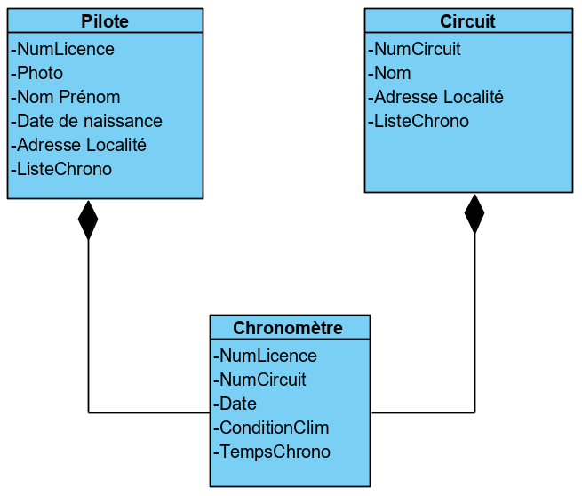

Travail C# 
Dossier 3ème partie

DELAVAL Kevin 
Groupe 2203

Le projet porte sur la gestion d'un club de motocross, il sera possible d'ajouter, supprimer, modifier des pilotes, des circuits ainsi que des temps chrono en rapport avec un pilote et un circuit.

Visualisation des classes principales

